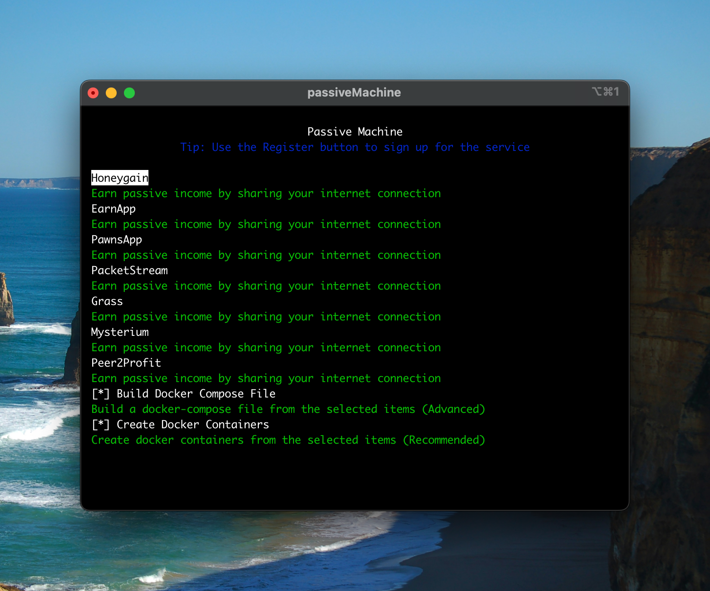
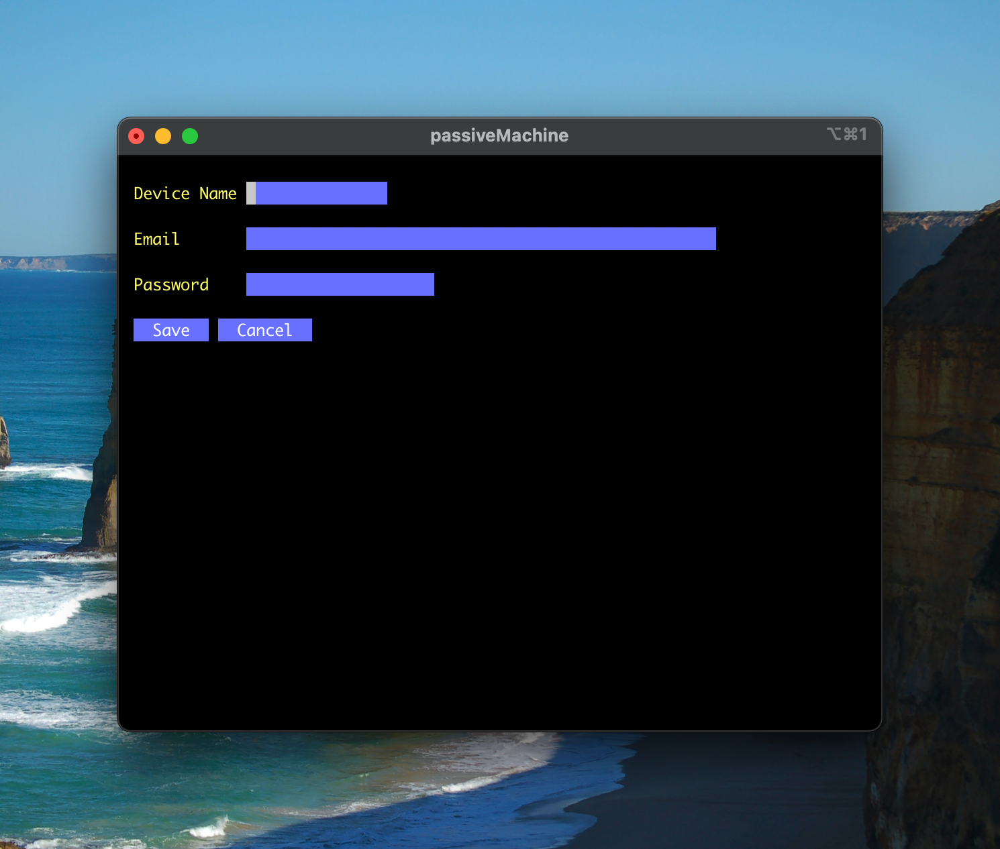
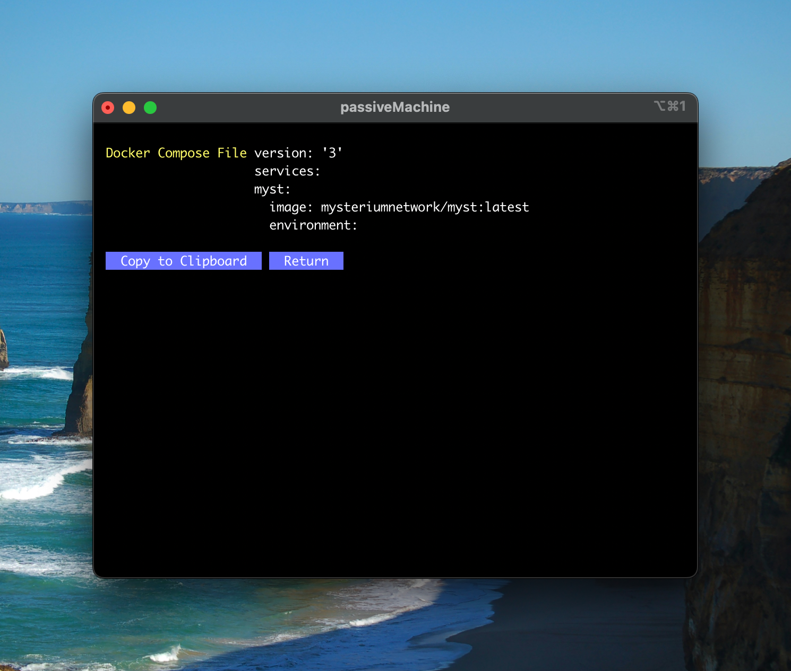

# Passive Machine

## Overview
Passive Machine automatically sets up multiple Docker containers for passive income services.

## Supported Services
- [EarnApp](https://earnapp.com/i/J9XF4PXJ)
- [Grass](https://app.getgrass.io/register/?referralCode=u154dPm508iVxXy)
- [Honeygain](https://r.honeygain.me/SAMUEC73)
- [Mysterium Nodes](https://mystnodes.co/?referral_code=ijIy8nJv8xqVoshRmJjKATvoZZYKZ3jhzOY3FWy6)
- [PacketStream](https://packetstream.io/?psr=4cRE)
- [PawnsApp](https://pawns.app/?r=1112060)
- [Peer2Profit](https://t.me/peer2profit_app_bot?start=1671204644639c8f24d663c)

## Requirements
- Docker

That's it! As long as you have a working Docker install, everything will work just fine.

## Downloads
- Windows
    - [x86_64 (you probably need this one)](https://github.com/Xpl0itU/passiveMachine/releases/latest/download/passiveMachine_Windows_x86_64.zip)
    - [i386 (old 32-bit CPU)](https://github.com/Xpl0itU/passiveMachine/releases/latest/download/passiveMachine_Windows_i386.zip)
    - [arm64](https://github.com/Xpl0itU/passiveMachine/releases/latest/download/passiveMachine_Windows_arm64.zip)
- macOS
    - [arm64 (Apple Silicon)](https://github.com/Xpl0itU/passiveMachine/releases/latest/download/passiveMachine_Darwin_arm64.tar.gz)
    - [x86_64 (Intel Mac)](https://github.com/Xpl0itU/passiveMachine/releases/latest/download/passiveMachine_Darwin_x86_64.tar.gz)
- Linux
    - [x86_64 (you probably need this one)](https://github.com/Xpl0itU/passiveMachine/releases/latest/download/passiveMachine_Linux_x86_64.tar.gz)
    - [i386 (old 32-bit CPU)](https://github.com/Xpl0itU/passiveMachine/releases/latest/download/passiveMachine_Linux_i386.tar.gz)
    - [arm64 (notably Raspberry Pi's)](https://github.com/Xpl0itU/passiveMachine/releases/latest/download/passiveMachine_Linux_arm64.tar.gz)

## Expected Earnings
These are the earnings you can realistically expect from each service, these are from personal experience with just one device and one IP address.
| Service Name    | Description                                                             | Realistic Earnings  |
| --------------- | ----------------------------------------------------------------------- | ------------------- |
| [EarnApp](https://earnapp.com/i/J9XF4PXJ)         | Mobile and desktop app that rewards users for sharing their internet connection | $2.50 per month    |
| [Grass](https://app.getgrass.io/register/?referralCode=u154dPm508iVxXy)           | Browser extension that rewards users for sharing their internet bandwidth | N/A (not live yet)    |
| [Honeygain](https://r.honeygain.me/SAMUEC73)       | Mobile and desktop app that rewards users for sharing their internet connection     | $7 per month   |
| [Mysterium Nodes](https://mystnodes.co/?referral_code=ijIy8nJv8xqVoshRmJjKATvoZZYKZ3jhzOY3FWy6) | Decentralized VPN network that rewards users for sharing their internet connection | $15-$30 per month   |
| [PacketStream](https://packetstream.io/?psr=4cRE)    | Desktop app that rewards users for sharing their internet connection     | $2 per month   |
| [PawnsApp](https://pawns.app/?r=1112060)        | Mobile and desktop app that rewards users for completing tasks and sharing their internet connection | $4 per month    |
| [Peer2Profit](https://t.me/peer2profit_app_bot?start=1671204644639c8f24d663c)     | Mobile and desktop app that rewards users for sharing their internet connection     | $3 per month   |

## Screenshots

## License
This project has been licensed under the GPL-3.0 license.
